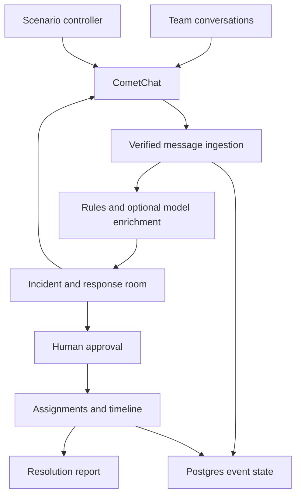
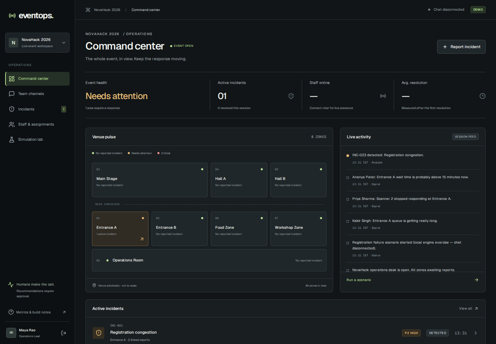
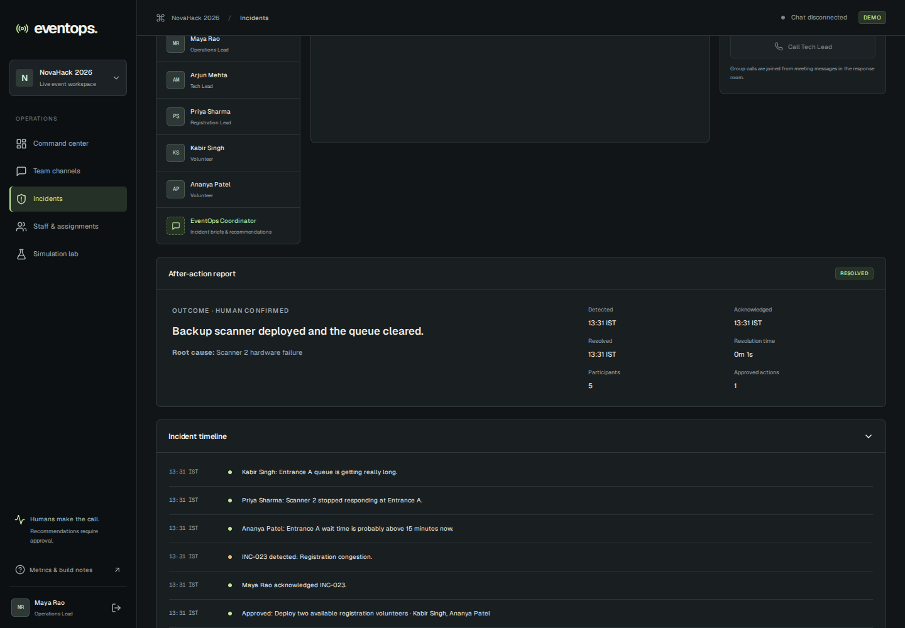

# EventOps

**From group chats to coordinated operations.**

EventOps is a live incident-command application for events that have already started. It correlates operational reports, opens private CometChat response rooms, proposes actions for human approval, and preserves the response timeline and closure report.

Built for the CometChat Zero to Chat challenge. NovaHack 2026 is a fictional 1,000-attendee event; this prototype seeds **eight responders**, seven team channels, and one coordinator account. No attendee data is collected.

## Run locally

Requires Node.js 22+ and npm.

```bash
git clone https://github.com/1shu1iwari-crypto/Event-Chat.git
cd Event-Chat
npm ci
cp .env.example .env.local
npm run dev
```

Open http://localhost:3000. Select Maya Rao to operate the desk, approve recommendations, and run scenarios. On localhost, the event access code is optional unless configured.

Without CometChat credentials, the simulation lab explicitly runs a **local engine exercise**. Chat, presence, and calls remain unavailable; no fake chat window is rendered. This local exercise is useful for inspecting the interface and domain workflow but is not a valid demonstration of live CometChat integration.

## Connect an existing CometChat app

The requested skill installers were run during development:

```bash
npm run skills:install
# Equivalent commands:
npx @cometchat/skills add --ide codex --family react
npx skills add Leonxlnx/taste-skill --agent codex --yes
```

The installer adds the CometChat docs MCP configuration for Codex. Restart your agent to load that MCP when needed. The CometChat pack is regenerated on demand rather than vendoring its duplicated manifests. The taste skill sources and lockfile are tracked.

Fetch credentials from an **existing** app:

```bash
npx @cometchat/skills-cli@3 auth login
npx @cometchat/skills-cli@3 provision list --json
npx @cometchat/skills-cli@3 provision use --app-id YOUR_EXISTING_APP_ID
```

Set the following **server-only** values in `.env.local`:

| Variable | Purpose |
| --- | --- |
| `COMETCHAT_APP_ID` | Existing CometChat app ID |
| `COMETCHAT_REGION` | App region: `in`, `us`, or `eu` |
| `COMETCHAT_REST_API_KEY` | A key with `fullAccess` scope from Dashboard → Credentials |
| `SESSION_SECRET` | Random secret, at least 32 characters, shared by all server instances |
| `EVENTOPS_ACCESS_CODE` | Shared demo access code; mandatory away from localhost |
| `APP_ORIGIN` | Exact application origin for the deployment |
| `DATABASE_URL` | PostgreSQL/Supabase pooled connection string for durable deployment |
| `LLM_API_KEY` | Optional OpenAI-compatible model credential |
| `LLM_BASE_URL`, `LLM_MODEL` | Optional model endpoint and model name |

The CLI calls its fetched value `authKey`; **do not assume this label guarantees full REST privileges**. Validate its scope or use the explicitly named REST API Key. EventOps needs full access for server user creation, private groups, membership, scenario messages, and token exchange. No Auth Key or REST key is bundled into browser JavaScript.

When you are ready to create the fictional demo accounts and channels in that app:

```bash
npm run seed
```

This creates or reuses `eventops-maya`, `eventops-arjun`, `eventops-priya`, `eventops-kabir`, `eventops-ananya`, `eventops-rohan`, `eventops-sara`, `eventops-neha`, and `eventops-coordinator`. It creates seven private groups named `eventops-novahack-<team>`. Existing users and conversations are not deleted. All eight staff can observe the team channels; incident rooms contain the selected responders and coordinator.

Restart the dev server after changing environment variables, then sign in. A second private browser window can sign in as another seeded persona to verify receiving, typing, receipts, presence, and calls.

## What works in the application

- Command center with report-driven event health, incident feed, venue schematic, and recorded resolution metrics.
- Seven operational team channels and direct staff conversations using CometChat React UI Kit 7.
- Dynamic private incident groups, verified membership, and a coordinator brief sent through CometChat.
- Built-in message delivery/read state, attachments, typing, threads, scoped search, presence, and voice/video controls.
- Deterministic registration-failure scenario plus Wi-Fi, speaker, food, projector, and overcrowding exercises.
- Explicit observations, tentative inferences, and heuristic confidence.
- Human approval, rejection, modified staff assignment, role guards, and double-booking prevention.
- Acknowledgement, escalation, resolution, archival, incident timeline, and structured after-action report.
- Cross-channel verified message ingestion: the server reads message IDs back from CometChat rather than trusting browser-supplied text.
- Optional model enrichment in LIVE mode; timeout, invalid output, or missing keys fall back to deterministic analysis.
- Responsive desktop command center and mobile incident/staff views.

Group calling posts a meeting message that members join; it does not ring every member. One-to-one escalation uses the Tech/Medical/Security Lead conversation and the kit's real call controls. Incoming calls are mounted once at the stable application root. Call-log availability is not assumed, and no fake call screen is implemented.

## Demo

See [the 90-second walkthrough](docs/DEMO.md). Start with Maya → Simulation lab → Registration failure → Command center → INC-023 → acknowledge → approve volunteers → collaborate/call → resolve.

Reset clears EventOps records and assignments, **not** CometChat history. A new run namespace ensures new incident rooms do not reuse the previous recording's conversation.

## Architecture



See [architecture details and limits](docs/ARCHITECTURE.md) and [CometChat documentation/build log](docs/COMETCHAT_MCP_BUILD_LOG.md).

## Checks

```bash
npm run typecheck
npm test
npm run build
npx playwright install chromium
npm run test:browser
```

Domain tests cover correlation prerequisites, stale/conflicting evidence, duplicate ingestion, independent concurrent incidents, human approval, unavailable staff, and closed-incident evidence. Local workflow/browser checks exercise the application with remote writes disabled. [Verification status](docs/VERIFICATION.md) distinguishes these checks from live integration testing.

## Deployment

Deploy as a Node.js Next.js application, for example on Vercel. Use `npm run build`. Set the server environment variables in the hosting dashboard; set `APP_ORIGIN` to the final HTTPS origin. Calls require HTTPS or localhost.

**For Vercel and multiple instances, configure `DATABASE_URL`.** The fallback `.data/event.json` is atomic single-process local storage; it is not durable serverless persistence. PostgreSQL creates the `eventops_state` table on first use. Use a database role allowed to create this table, or provision it ahead of deployment:

```sql
CREATE TABLE IF NOT EXISTS eventops_state (
  id text PRIMARY KEY,
  state jsonb NOT NULL
);
```

The prototype uses shared access-code demo identities. Replace the selector with individual staff identity verification/SSO before operating a real event. Replace the in-memory rate limiter with a shared limiter for a public production deployment.

## Research hypothesis

Cross-team signal correlation and focused response rooms may reduce detection-to-acknowledgement and assignment latency. The metrics page records actual timings. It does not claim that this prototype demonstrates a causal improvement; a controlled comparison needs repeated matched scenarios and human-only/reactive/proactive conditions.

## Screenshots

Screenshots in `docs/screenshots/` are from an explicitly labelled local engine exercise. They do not establish live messaging or call connectivity.




